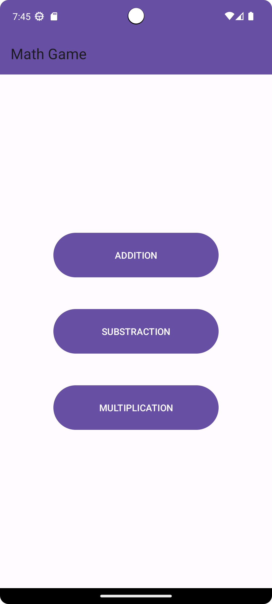
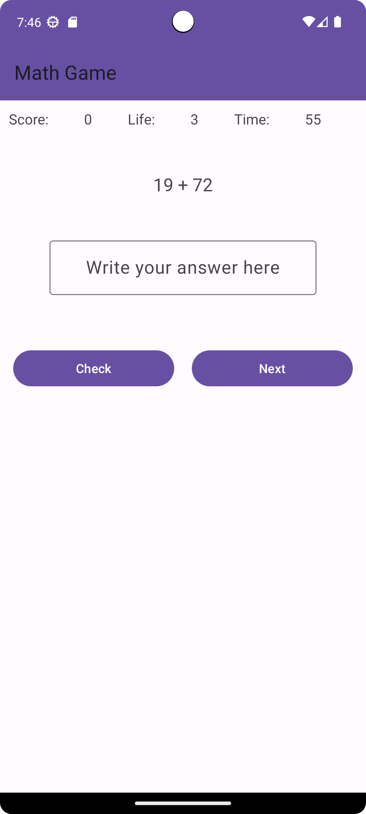

# Math Game

Math Game is a simple mobile application designed to teach users basic math operations and improve their skills.

## Features

- Option to choose addition, subtraction, or multiplication operation.
- Requirement to provide correct answers within a specific time.
- Mechanism to earn points with correct answers and lose lives with incorrect answers.
- User-friendly interface and easy gameplay.

## Screenshots

## License

This application is released under MIT license (see [LICENSE](LICENSE)).
